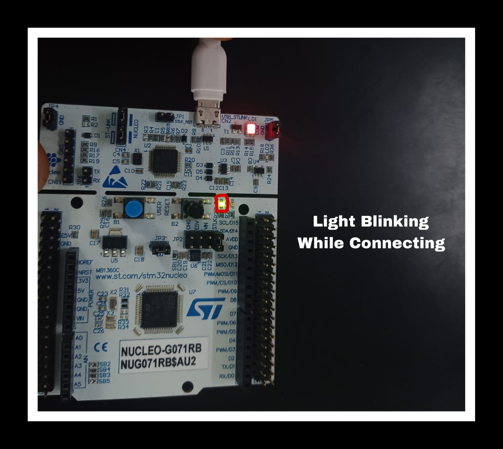
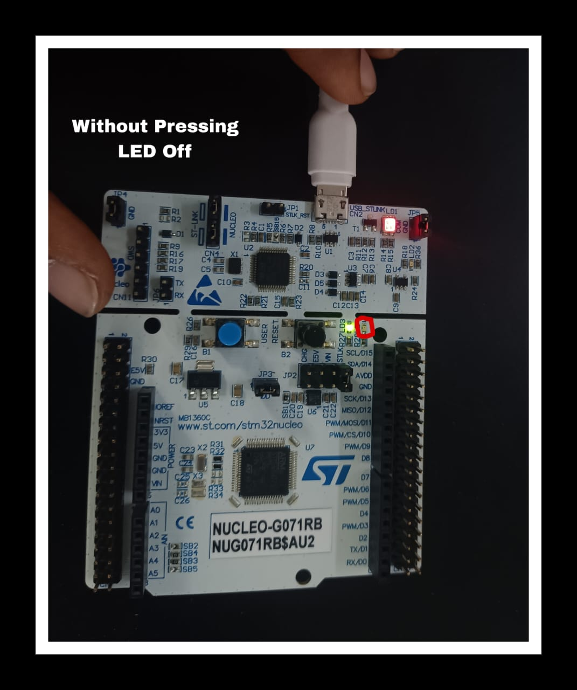
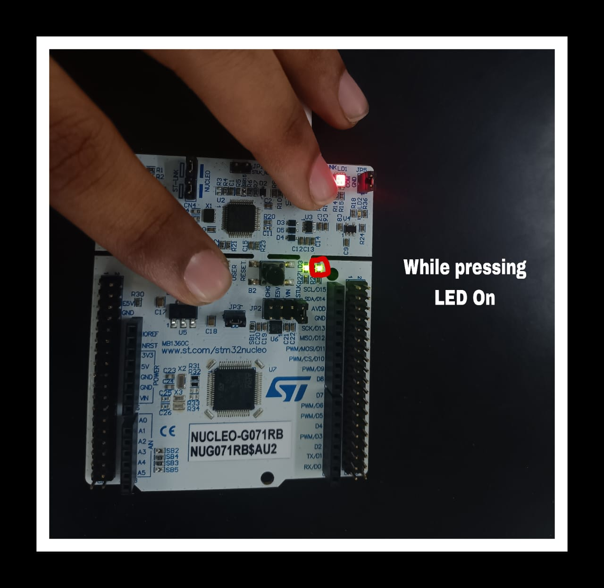

# EXPERIMENT--02-INTEFACING-A-DIGITAL-INPUT-TO-ARM-DEVELOPMENT-BOARD
## Aim: To Interface a Digital Input  (userpush button  ) to ARM   development board and write a  program to obtain  the data and flash the led  
## Components required: STM32 CUBE IDE, ARM IOT development board,  STM programmer tool.
## Theory 
The full form of an ARM is an advanced reduced instruction set computer (RISC) machine, and it is a 32-bit processor architecture expanded by ARM holdings. The applications of an ARM processor include several microcontrollers as well as processors. The architecture of an ARM processor was licensed by many corporations for designing ARM processor-based SoC products and CPUs. This allows the corporations to manufacture their products using ARM architecture. Likewise, all main semiconductor companies will make ARM-based SOCs such as Samsung, Atmel, TI etc.

 
  
## Procedure:
 1. click on STM 32 CUBE IDE, the following screen will appear 
 

 2. click on FILE, click on new stm 32 project 
 

3. select the target to be programmed  as shown below and click on next 


4.select the program name 


5. corresponding ioc file will be generated automatically 

6.select the appropriate pins as gipo, in or out, USART or required options and configure 

7.click on cntrl+S , automaticall C program will be generated 


8. edit the program and as per required 

9. use project and build all 
10. once the project is bulild 


11. click on debug option 

12. connect the  ARM board to power supply and usb 


13. check for execution of the output using run option 


## STM 32 CUBE PROGRAM :
### Name : Yuvaraj S
### Register Number : 212222240119
```c
#include "main.h"
#include"stdbool.h"
bool pushbutton;
void SystemClock_Config(void);
static void MX_GPIO_Init(void);
int main(void)
{
    HAL_Init();
    SystemClock_Config();
    MX_GPIO_Init();
    while (1)
    {
        pushbutton=HAL_GPIO_ReadPin(GPIOC,GPIO_PIN_13);
        if(pushbutton==0)
        {
	        HAL_GPIO_WritePin(GPIOA, GPIO_PIN_5, GPIO_PIN_SET);
	        HAL_Delay(1000);
	        HAL_GPIO_WritePin(GPIOA, GPIO_PIN_5, GPIO_PIN_RESET);
	        HAL_Delay(1000);

        }
        else
        {
	        HAL_GPIO_WritePin(GPIOA, GPIO_PIN_5, GPIO_PIN_RESET);
	        HAL_Delay(1000);
        }
    }
}
```


## Output  :



 
## Result :
Interfacing a digital Input (Pushbutton ) with ARM microcontroller based IOT development is executed and the results are verified.
